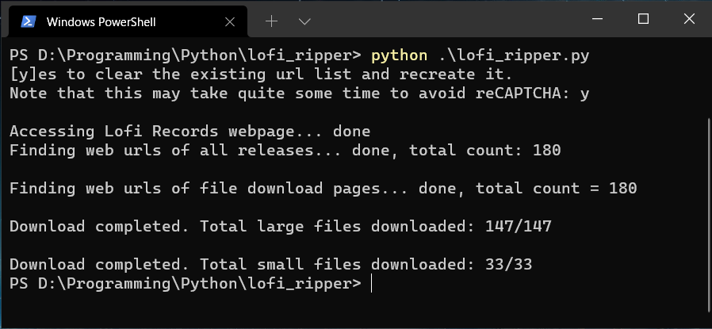

# Lofi Girl Ripper
Hey there! You should probably read this ↓↓↓ first, idk it just looks pretty important. 
>Disclaimer: this program and all the associated files are only intended for educational purporses. Please do not use them to cause harm to any third party and/or the author. 

## A neat little Python program to rip *all* the tracks from the Lofi Girl (or more formally, "Lofi Records") at once, with a (close to) fully automated process. 
(Below are the `zh-cn` and `jp` translations.)

---
如果您看不太懂英语：使用此Python程序，您可以一次性将Lofi Girl（正式称呼为Lofi Records）网站上的*所有*歌曲进行下载。下载的过程几乎是全自动的。如果您不知道该如何使用该程序，还烦请您自行用翻译软件进行翻译参考。（如果翻译后也看不懂的话，当然提问也是OK的。）

英語が苦手な方へ：このPythonプログラムによって、一発でLofi Girl（正式にはLofi Recordという）のウェブサイトから*すべての*音楽をダウンロードできます。因みにほぼ全自動です。使い方が分からない場合には、お手数ですが、自力でどこかの翻訳ソフトで訳してみてください。（もちろんそれでも分からない場合だったら質問をいただいてもオッケーです。）

---
Dependencies: `requests`, `bs4`, `gdown`\
Please make sure you have the above libraries available before trying out this program. 

If you don't have them installed or have no idea what they are, run these commands in your terminal. 
```
pip install requests
pip install bs4
pip install gdown
```
If you don't have `pip` installed, click [here](https://pip.pypa.io/en/stable/installation/) to see their documentations regarding the installation process. 

This program was written with Python 3.9.4, but it should work on pretty much any version you might have already installed. \
If it somehow doesn't work with your version, try updating Python. It might help. 

---
## How do I use this thing??? 
It's simple. First clone this repository into an existing folder on your device, with the following command. 
```
git clone https://github.com/Yuuki-Sora/lofi-girl-ripper
```
Next, somehow navigate into the cloned folder (maybe with a `cd` command if you're running Linux), and run the following command to start the execution of the prorgam. 
```
python lofi_ripper.py
```
or
```
python3 lofi_ripper.py
```
or something else, depending on how you configured your path variables. 

And then the download process should automatically begin. \
When prompted the follwoing: 
```
[y]es to clear the existing url list and recreate it. 
Note that this may take quite some time to avoid reCAPTCHA: 
```
Please input `y` if you're launching the program for the first time, or wish to regenerate the list of links to the downloadable files. 

>Note that since the target website is protected by reCAPTCHA, there is a random delay of around 10 seconds between each accesses. \
It might seem slow, but trust me, it's better than getting banned. \
If you know exactly what you're doing, you can edit this part and make it faster. \
I'm not very sure how fast you can go without getting into trouble. 

However, if you've already created the lists and do not want to update them, you can simply input any other character, and this would take you to the second confirmation screen: 
```
[y]es to fetch files from existing url list: 
```
If you wish to re-download all the music files using the existing lists, please input `y`. 

The download process should then start, and when finished it should look something like this: 


---
The credit of the file "g_fetcher.py" goes to [this StackOverflow answer](https://stackoverflow.com/questions/25010369/wget-curl-large-file-from-google-drive/39225039#39225039), and is used to fetch large files from Google Drive. \
Smaller files could be directly downloaded, as you'll see very soon. 

THE SOFTWARE IS PROVIDED "AS IS", WITHOUT WARRANTY OF ANY KIND, EXPRESS OR IMPLIED, INCLUDING BUT NOT LIMITED TO THE WARRANTIES OF MERCHANTABILITY, FITNESS FOR A PARTICULAR PURPOSE AND NONINFRINGEMENT. IN NO EVENT SHALL THE AUTHORS OR COPYRIGHT HOLDERS BE LIABLE FOR ANY CLAIM, DAMAGES OR OTHER LIABILITY, WHETHER IN AN ACTION OF CONTRACT, TORT OR OTHERWISE, ARISING FROM, OUT OF OR IN CONNECTION WITH THE SOFTWARE OR THE USE OR OTHER DEALINGS IN THE SOFTWARE. 

Hopefully you should have some fun with this stuff, and feel free to take proper actions (such as opening an issue) when you find something weird happening or something not working properly. \
I'll try my best to see what I can do. 